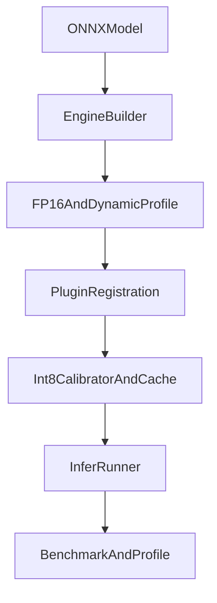

# Execution Pipeline

## Phase Outputs

- Phase 0: compile-ready scaffold with config and docs.
- Phase 1: FP32 E2E with engine serialization.
- Phase 2: FP16 + dynamic shape profiles.
- Phase 3: plugin interface and correctness script.
- Phase 4: INT8 calibrator and cache flow.
- Phase 5: benchmark and profiling scripts.
- Phase 6: reproducible runbooks and reports.
